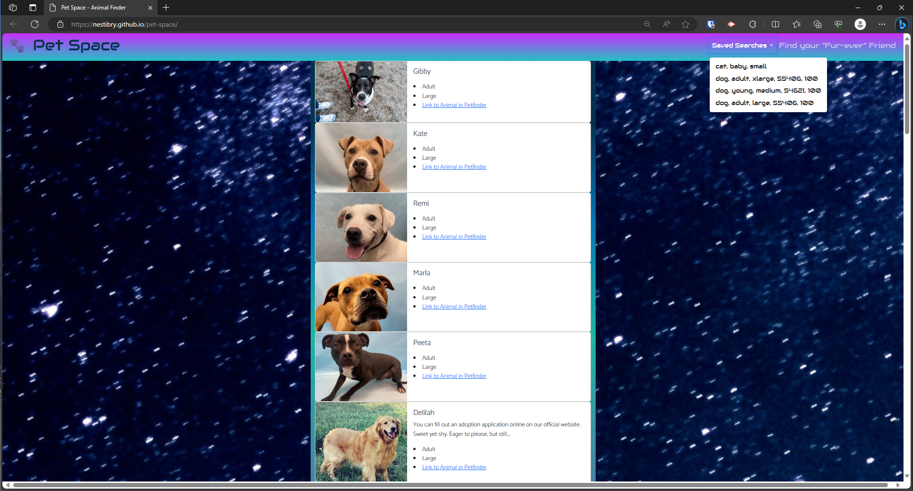

# 🐾 Pet Space
Search for pets for adoption using PetFinder API. Pet Space is a pet adoption tool to link users to multiple rescue organizations to help find a "fur-ever" animal friend!

#### Deployed Site: https://nestibry.github.io/pet-space/


## User Story
```
AS A potential pet parent searching for the perfect pet,
I WANT to be able to search by animal type, age, size, and location.
SO THAT I can find my dream pet!
```

## Acceptance Criteria
```
GIVEN a website I am able to search for a pet.

WHEN I enter my criteria for a pet,
THEN I want to view potential matches.

WHEN I view a pet profile,
THEN I am able to see a description of the pet and pictures of the pet.

WHEN I find matches,
THEN I am able to save them.

WHEN I find the best match,
THEN I am able to fill out a form to inquire about my pet match.

```

## Visuals




## Files

    Bootstrap: index.html
    jQuery: ./assets/js/script.js
    Popcorn: (all above) and ./assets/css/style.css

## 🐾 Pet Space Roadmap
Pet Space is an MVP project. Here a few improvements the team has identified and are open to more suggestions:
- Evolve and expand its ease of user interface
- Incorporate a live contact form
- Improve Petfinder API call time to render the animal lists


## Authors and acknowledgment
- Thanks so much for the help of the creators of Bryan Nestingen, Veronica Perez, Shahan Ameen and Holly Thompson.


## Credits

- [Petfinder API](https://www.petfinder.com/developers/v2/docs/)
- © 2023 Bryan Nestingen, Veronica Perez, Shahan Ameen and Holly Thompson
- *© 2023 edX Boot Camps LLC. - University of Minnesota - Coding Boot Camp*


## License
- [MIT License](https://choosealicense.com/licenses/mit/)


